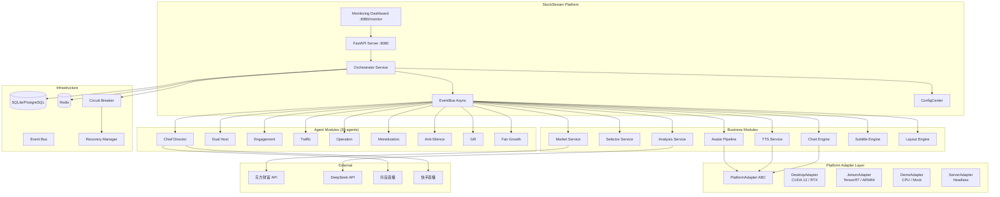
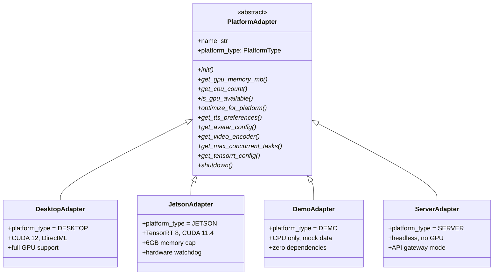
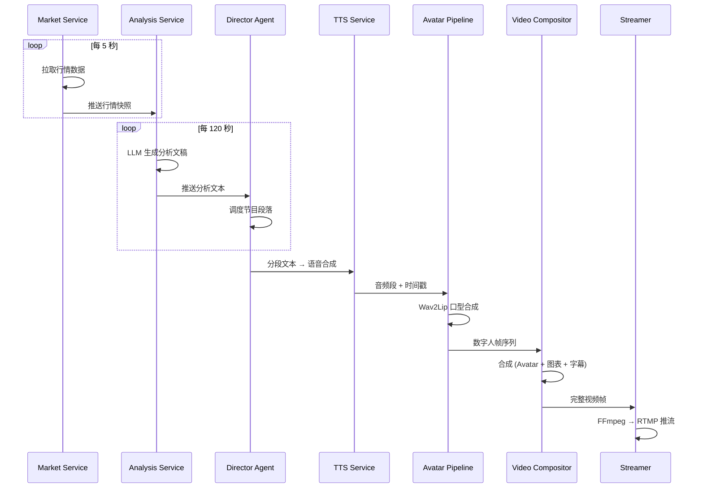
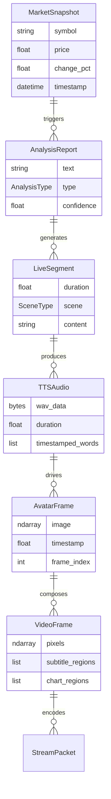

# Architecture Diagram — StockStream V4.0 Enterprise

> **文档类型**: 架构设计文档 (替代 PDF — 使用 Mermaid 渲染)  
> **版本**: V4.0 Enterprise  
> **日期**: 2026-06-29

---

## 1. 系统全景架构 (C4 Level 1 — Context)

```
┌──────────────────────────────────────────────────────────────────┐
│                         StockStream                              │
│                 AI 数字人财经直播平台                              │
└──────────────────────────────────────────────────────────────────┘
         │              │              │              │
         ▼              ▼              ▼              ▼
   ┌─────────┐   ┌─────────┐   ┌──────────┐   ┌──────────┐
   │ 东方财富  │   │ DeepSeek│   │ 直播平台  │   │ 观众/用户 │
   │ (行情源)  │   │ (AI模型) │   │ (推流)    │   │ (浏览器)  │
   └─────────┘   └─────────┘   └──────────┘   └──────────┘
```

## 2. 容器架构 (C4 Level 2 — Container)



## 3. 平台适配层架构 (Adapter Pattern)



## 4. 配置层级继承

```
configs/
├── base.yaml                    ← 第1层: 全局默认值
│   └── host, port, log_level, ...
│
├── {platform}.yaml              ← 第2层: 平台覆盖
│   │   desktop.yaml ── CUDA 12, 4 workers
│   │   jetson.yaml  ── TensorRT, 1 worker, 6GB limit
│   │   demo.yaml    ── mock data enabled
│   │   production.yaml ── security + monitoring enabled
│   │   test.yaml    ── in-memory DB, debug logging
│   │
│   └── environment/
│       ├── dev/                ← 第3层: 环境覆盖
│       │   └── desktop.yaml ── debug, reload, metrics
│       ├── test/
│       │   └── ci.yaml      ── CI mode, ephemeral DB
│       ├── production/
│       │   ├── desktop.yaml ── SSL, rate limit, full security
│       │   └── jetson.yaml  ── watchdog, auto-recovery
│       └── release/           ← 第4层: 发布版本
│           ├── dev-desktop.yaml
│           ├── demo.yaml
│           ├── production-desktop.yaml
│           └── production-jetson.yaml
│
└── .env.example                ← 敏感信息模板
```

**加载顺序**: `base → platform → environment → env vars` (后者覆盖前者)

## 5. 数据流 — 一次直播推流周期



## 6. 核心领域模型 (DDD 聚合边界)



## 7. 发布版本矩阵

```
                    ┌─────────────────┐
                    │  StockStream V4  │
                    │   一套源码        │
                    │   95%+ 代码共享   │
                    └────────┬────────┘
                             │
        ┌────────┬───────────┼───────────┬──────────┐
        ▼        ▼           ▼           ▼          ▼
   dev-desktop  demo  prod-desktop  prod-jetson  (未来: web-cloud)
   开发/调试    演示    桌面生产     边缘生产       云端SaaS
   Win/Linux   CPU     Win/Linux    Jetson NX    Cloud Run
   RTX GPU     Mock    RTX GPU     TensorRT     T4/A100
   Python3.10  Py3.8+  Python3.10  Python3.8    Py3.12
```

## 8. 技术选型全景

| 层 | 技术 | 用途 |
|----|------|------|
| **Web** | FastAPI + Uvicorn | HTTP API + WebSocket |
| **异步** | asyncio + EventBus | 模块间通信 |
| **AI 模型** | ONNX Runtime / TensorRT | 跨平台推理 |
| **TTS** | Piper (ONNX) | 语音合成 |
| **数字人** | Wav2Lip (ONNX) | 口型同步 |
| **图表** | Matplotlib + NumPy | K线/技术指标渲染 |
| **推流** | FFmpeg subprocess | RTMP 直播推流 |
| **存储** | SQLite + Redis | 行情缓存 + 配置 |
| **监控** | Prometheus + Grafana | 指标 + 仪表盘 |
| **容器** | Docker + Compose | 4 版本独立部署 |
| **CI/CD** | GitHub Actions | 矩阵测试 + 构建 |

---

*本文档可用 Mermaid 渲染器 (mermaid.live) 或 VS Code Mermaid 插件查看.*
